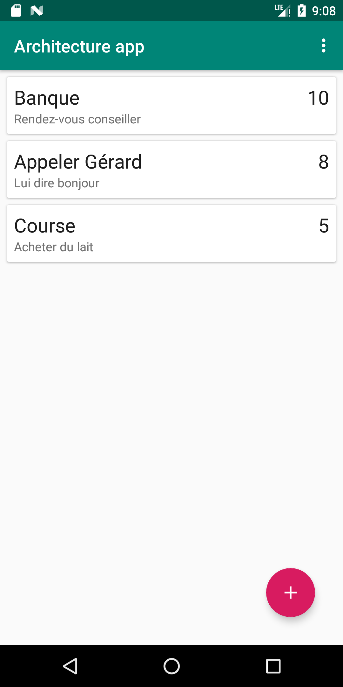
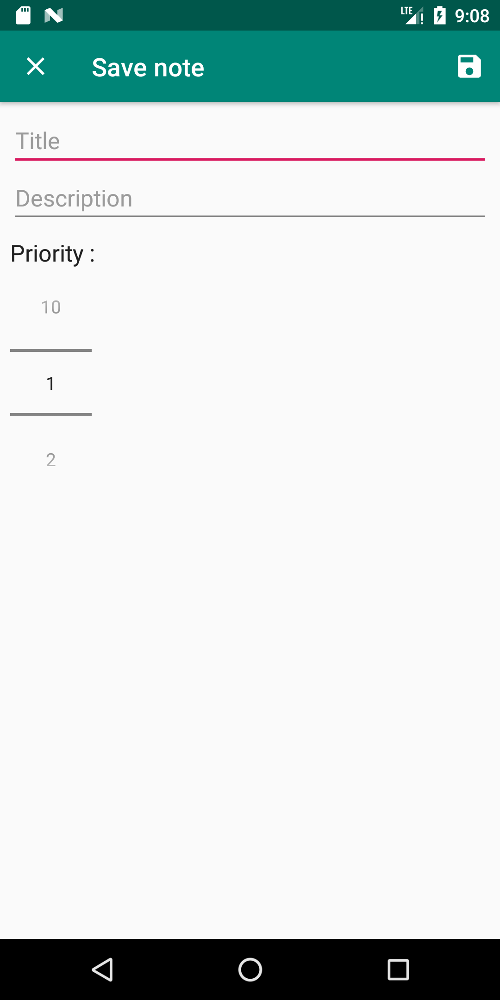
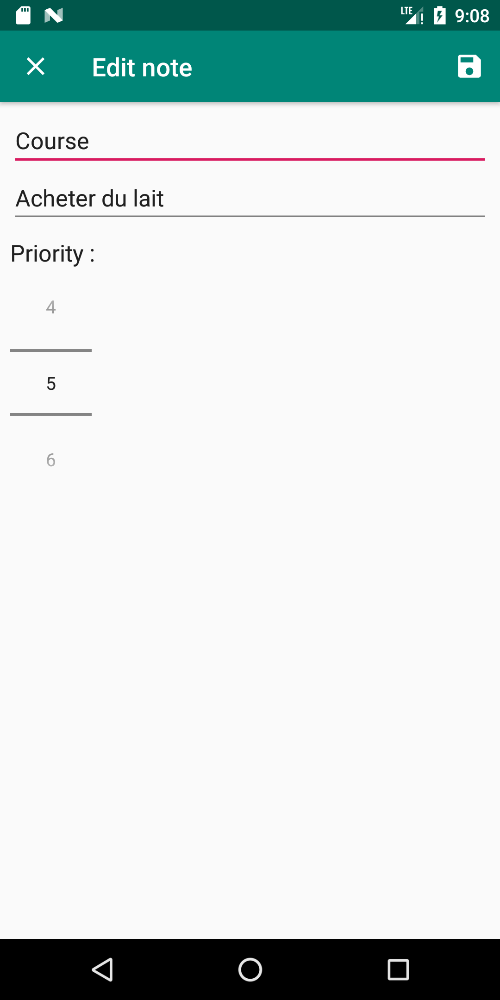
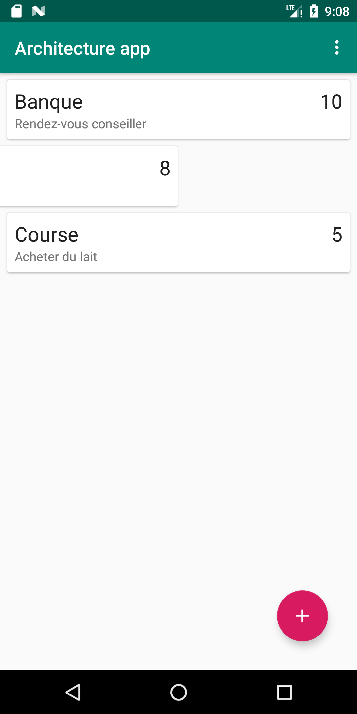

# ArchitectureApp
## Concepts mis en oeuvre
- Architecture components (Room, ViewModel, Databing, LiveData)
- MVVM implémentation
- RecyclerView (custom ListAdapter, swip to delete, edit item)
## Version SDK
- minSdkVersion : **19**  
- targetSdkVersion : **28**
## Librairies utilisées
- implementation 'androidx.appcompat:appcompat:1.1.0'
- implementation 'com.google.android.material:material:1.0.0'
- implementation 'androidx.cardview:cardview:1.0.0'
- implementation 'androidx.constraintlayout:constraintlayout:1.1.3'

**ViewModel and LiveData**
- implementation "androidx.lifecycle:lifecycle-extensions:2.1.0"
- annotationProcessor "androidx.lifecycle:lifecycle-compiler:2.1.0"

**Room**
- implementation "androidx.room:room-runtime:2.2.0-rc01"
- annotationProcessor "androidx.room:room-compiler:2.2.0-rc01"
## Captures d'écran
   
